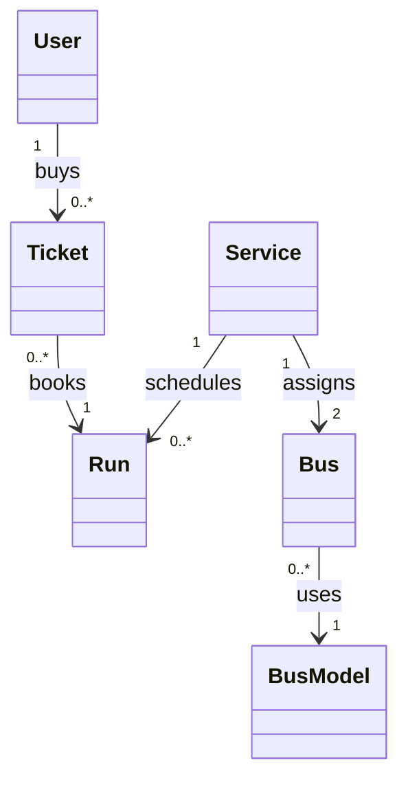

# FlyOnWheels / Bus Ticket Booking System

A menu-driven, object-oriented inter-city bus booking application for TU Dublin Week 10. Administrators view and create services; ordinary users browse dated runs, buy seat quantities and view their booking history. SQLite preserves accounts, services and bookings between launches.

Statement of provenance: The code content in this repository was written with the assistance of GitHub Copilot. The corrective refactoring, tests and documentation also used OpenAI Codex / GenAI assistance.

## Setup and run

Use Python 3.10 or newer with SQLite support. There are no third-party dependencies. Run these commands from the project directory (use `python3` if that is your system's Python command).

```bash
python create_database.py
python test_database.py
python main.py
```

**`python create_database.py` deliberately resets all booking data** and creates a fresh seven-day demonstration dataset. Back up any database you want to keep before using it. The public `create_database()` function performs the same reset for the lecturer tests.

**Normal `python main.py` startup preserves existing data.** It creates and seeds a missing or empty database once. The database path is resolved beside `create_database.py`, so launching from another working directory still uses the same file. `test_database.py` only reads/dumps that file.

An existing singular database using the older date-column spelling is upgraded to `run.date` without changing records or IDs. An incompatible database is refused rather than overwritten. A legacy plural-only database needs a backup and an explicit reset; there is no automatic conversion of its ambiguous ticket data. An explicit reset also removes obsolete plural tables left by the old implementation.

Initial administrator:

```text
Username: Bob
Password: pqr123#!
```

## Menus

- Home: log in, create an account, exit.
- Admin: view services, create a service, log out.
- Customer: view future bus runs, buy tickets, view bought tickets, log out.

Run choices use the **displayed list position**. Enter a positive whole number of tickets, then press Enter to confirm or type `esc` to cancel. Invalid selections, blank account/service fields, duplicates and over-capacity bookings are rejected. Usernames/service names are trimmed and remain case-sensitive. Passwords retain their exact characters, but cannot be blank or whitespace-only.

## Files

| File | Purpose |
| --- | --- |
| `main.py` | Authentication, database queries, model mapping, booking rules and the three menus. |
| `create_database.py` | Canonical schema, seed data, shared password hash and safe startup initialization. |
| `test_database.py` | Read-only dump of every user-defined table, for inspecting relationships. |
| `user.py`, `service.py`, `run.py` | Part 1 account, service and dated-run classes. |
| `bus.py`, `bus_model.py`, `ticket.py` | Part 1 physical bus, capacity and booking classes. |
| `test_main.py` | Supplied lecturer scenario tests, kept unchanged. |
| `test_booking.py` | Isolated account, service, input, capacity and concurrent-booking tests. |
| `test_persistence.py` | Isolated startup, migration and two-process restart tests. |
| `flyonwheels.db` | Committed seed snapshot; explicit setup refreshes dates to the day it runs. |
| `bus_systemdiagram.jpg` | Original six-concept diagram photo; see the precise relationships below. |
| `url_link.txt` | Existing screencast URL; update after recording the corrected application. |
| `.gitignore` | Excludes generated Python bytecode, virtual environments and SQLite sidecars. |

## Database and model structure

There is one canonical schema:

| Class | Table | Stored fields |
| --- | --- | --- |
| `User` | `user` | `id`, `username`, `password` (hash), `admin` |
| `Service` | `service` | `id`, `name` (route and departure time) |
| `Run` | `run` | `id`, `service_id`, `date` (`YYYY-MM-DD`) |
| `BusModel` | `bus_model` | `id`, `name`, `seats` |
| `Bus` | `bus` | `id`, `service_id`, `bus_model_id`, `schedule_type` |
| `Ticket` | `ticket` | `id`, `user_id`, `run_id`, `number` |

`Ticket.number` is the **quantity of seats purchased in one booking**, not an assigned seat identifier. `run.date` follows the exact field name in lecturer screenshot 9.

`authenticate_user()` returns a `User`; `list_services()` returns `Service` objects. `list_future_runs()` groups `Run`, `Service`, `Bus` and `BusModel` objects in a small `RunDetails` record for display/selection. `list_user_tickets()` groups a `Ticket`, its `Run` and its `Service` in `TicketDetails`. These two grouping records add no database tables. SQL remains responsible for `bus_model.seats - SUM(ticket.number)`.

Foreign keys are enabled on application connections. Reset-created databases enforce unique usernames, service names, service/date pairs and service/schedule assignments. Booking checks and inserts share a write transaction so two app instances cannot oversell the last seat.

## Class diagram and relationships

[Original diagram photo](bus_systemdiagram.jpg) (earlier sketches are retained as `bus_system.jpg` and `bus_system (2).jpg`). The following diagram clarifies the current implementation and multiplicities:



A user owns many tickets; each ticket links to one run. Each run belongs to one service. Each service has two physical bus assignments, and each bus uses one bus model. The run's bus is selected through its service and date: Saturday/Sunday use the weekend assignment, Monday-Friday use the workday assignment. There is no separate stored run-to-bus foreign key.

## Required seed data

- Bob is the one administrator, with a hash of `pqr123#!`.
- Three services: `Dublin to Kilkenny, 7pm`, `Dublin to Letterkenny, 8am`, `Dublin to Wicklow, 6pm`.
- Models A (30 seats) and B (50 seats).
- Seven dates from today, inclusive, for each service: 21 run rows.
- Two buses per service: model A on weekends and B on workdays (6 bus rows).
- One Bob booking for tomorrow's Letterkenny run, with `number = 1`.

Creating a service through the admin menu also creates exactly seven dated runs and two physical bus rows in one transaction.

## Tests

```bash
python -m unittest test_main.py -v
python -m unittest discover -v
```

The lecturer suite deliberately resets the project database in `setUp()`. Discovery includes that suite, so it also resets the project database. Use a disposable copy or back up your data first. Running the application itself never performs that reset.

To run only the new tests, which use temporary databases:

```bash
python -m unittest test_booking.py test_persistence.py -v
```

Verified on Windows with Python 3.14.2: 2 lecturer tests and 18 total tests passed. Coverage includes account/service validation, all six model types, seven-run/two-bus creation, numeric menu errors, booking quantities, cancellation, capacity reduction, weekday/weekend selection, a last-seat race, past-run rejection, foreign keys and persistence across two actual processes. The unchanged lecturer scenario also checks the role menus.

For a visible restart demonstration, create a customer and buy two seats, log out/exit, then launch `python main.py` again. Log in with that customer and view bought tickets. Do not run the reset script or lecturer tests between launches.

## Scope and submission notes

- Password hashing remains unsalted SHA-256 to preserve existing logins and keep this assignment's refactor small. A real deployment should migrate to a salted, deliberately slow password hash such as PBKDF2 or scrypt. This is a documented future improvement, not a claim of production password security.
- Runs cover the seven days created by setup/service creation. They are not automatically extended on later launches. Existing history remains available after runs expire. The menu filters by date, not by the departure time embedded in the service name.
- The original diagram photos are retained as evidence; use the precise relationships above when explaining the code. The existing video was not re-recorded or its duration verified in this corrective pass.
- Lecturer screenshots describe a `week10` subdirectory in a module repository. This standalone repository's existing root layout is preserved. If grading reads a separate module repository, these files still need to be placed in its `week10` directory.
- The earlier Git history contains Part 1 and Part 2 together in the public release. The corrective commits preserve that history; they do not pretend that a separate historical Part 1 commit existed.
- Complete corrective work on `week10-assignment`, push it, then open a PR targeting `main`, merge after checks pass, and synchronize `main`. The lecturer requires the final work to be visible on `main`.
